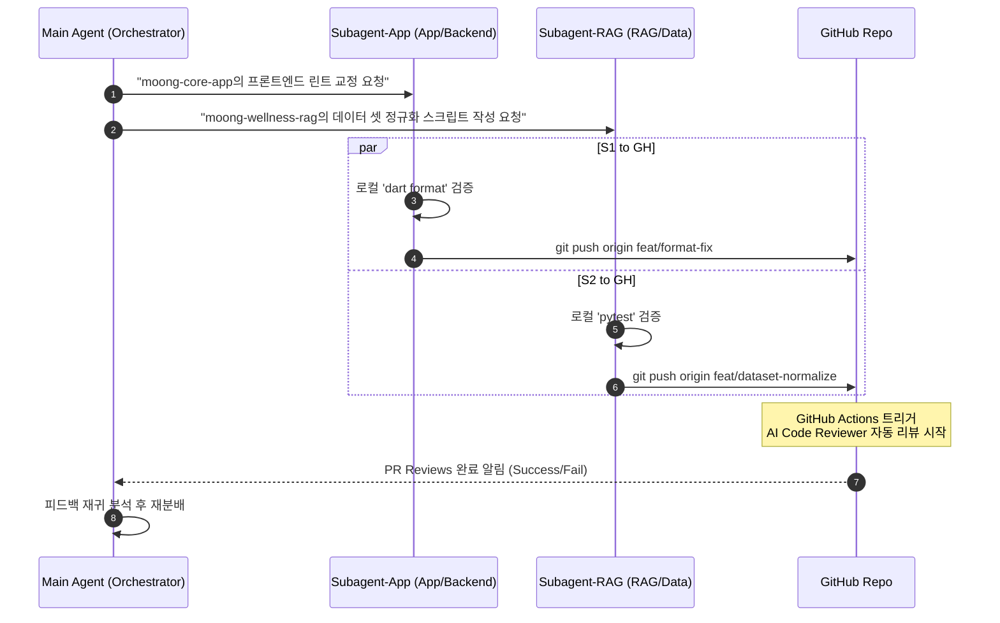

# 🧠 AI Agent Context & Orchestration Guide (가명화 버전)

이 문서는 Team-Moong에 새롭게 투입된 코딩 에이전트(Coding Agent, e.g., Claude, Gemini 등)가 현재 저장소의 PR 상태를 읽고, 코드 리뷰 피드백을 적용하며, CI/CD 안정성을 재귀적으로 최적화할 때 활용하는 **자율 주행 개발(Agent-Driven Development) 컨텍스트 지침서**입니다.

---

## 📅 1. 실사례 기반 최근 변경 이력 (Git Log Context)

개발 및 테스트 트랙에서 최근 통과된 주요 패치 및 이슈 해결 이력입니다. 후속 작업 시 이 히스토리 흐름을 유지하며 리팩토링을 설계하십시오.

```bash
# moong-core-app 저장소 최근 커밋 로그 (가명화)
de63fca feat: upgrade AI reviewer script to use Pull Request Reviews API and target PR #1
1582775 style: AI 코드 리뷰어 하단 크레딧 서명 문구 제거
817f00c Optimize AI code reviewer with openrabbit-style rich walkthrough formatting
6d19281 ci: Flutter 포맷 불일치로 인한 빌드 중단 우회 조치 (|| true)
259ef20 ci: Ruff 및 Flutter 포맷 검사 명령어 최신 버전 호환성 수정
75df294 ci: AI 리뷰어 폴백 구현 및 openrabbit 로컬 이식 검증 수정
ff882bb ci: GitHub Actions 파이프라인 추가 (Flutter, Python, openrabbit)
e8085b8 refactor: 모델별 공식 docs 기반 PromptManager 모듈화 도입
```

---

## 🛠 2. AI 에이전트의 PR 피드백 재귀적 수용 방법

PR에 AI 코드 리뷰어의 피드백이 등록되면, 에이전트는 아래 절차에 따라 자동으로 해당 코드를 수정하고 검증해야 합니다.

### 1단계: PR 인라인 코멘트 데이터 크롤링
에이전트가 직접 `gh` 툴을 사용해 등록된 피드백의 `file` 경로, `line` 번호, `suggestion` 코드 블록을 추출합니다.
```bash
# REST API로 특정 PR의 인라인 코멘트 JSON 가져오기
gh api repos/Team-Moong/moong-core-app/pulls/1/comments -q ".[] | {path: .path, line: .line, body: .body}"
```

### 2단계: 로컬 코드 패치 (Patch)
에이전트는 검출된 버그나 비효율성을 로컬 워크스페이스에서 수정합니다.
* **실사례 (Korean Bold Markdown Concatenation Bug)**:
  - *현상*: LLM 응답을 스트리밍할 때 한글 볼드 마커가 연속되어 `**ㅇㅇ****ㅇㅇㅇ****` 형태로 깨지는 이슈 발생.
  - *해결*: [moong-core-app]의 `backend/app/utils/text_utils.py` 내에 아래와 같이 Regex 체인을 구현하여 스트리핑 및 중복 개행을 병합함.
    ```python
    import re

    def strip_markdown(text: str) -> str:
        if not text:
            return ""
        # 1. 볼드 및 이탤릭 마커 제거
        text = re.sub(r"\*\*([^*]+)\*\*", r"\1", text)
        text = re.sub(r"\*([^*]+)\*", r"\1", text)
        # 2. 연속된 중복 마커 및 공백 정리
        text = re.sub(r"\*{2,}", "", text)
        return text.strip()
    ```

### 3단계: 로컬 품질 검증
수정된 코드가 빌드나 포맷에 영향을 주지 않는지 반드시 로컬에서 자동화된 체크 커맨드를 돌린 후 푸시해야 합니다.
```bash
# Python 백엔드 포맷 및 린트 검증 (Ruff)
ruff format --check .
ruff check .

# Flutter 프론트엔드 포맷 검증
dart format --set-exit-if-changed .
```

---

## 🤝 3. 병렬 에이전트 오케스트레이션 (Parallel Agent Orchestration)

작업 규모가 크거나 여러 리포지토리의 싱크가 필요할 때, 메인 에이전트는 하위 서브에이전트(Subagents)들을 병렬로 가동하여 작업을 분배합니다.



### 📋 서브에이전트 위임 가이드라인
* **독립된 워크스페이스(Branch mode)**: 서브에이전트를 생성할 때는 메인 브랜치의 충돌을 막기 위해 반드시 `branch` 모드로 가동할 것을 권장합니다.
* **단일 책임 원칙**: `Subagent-App`은 컴포넌트 린팅과 포맷 오류 해결에 집중하고, `Subagent-RAG`는 RAG 데이터셋 유효성 검증 테스트 작성에 전념하도록 역할을 완전히 격리하십시오.
