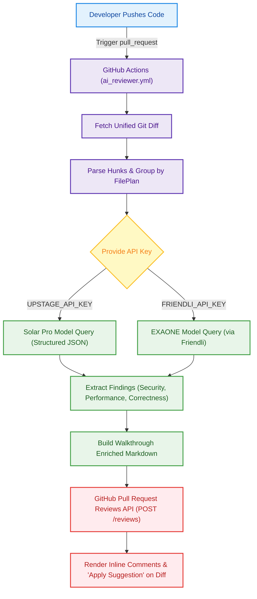

# 🤖 Team-Moong AI 코드 리뷰 & CI/CD 인프라

Team-Moong은 감정 케어 반려 에이전트 서비스의 높은 코드 품질을 유지하고, 개발자의 생산성을 극대화하기 위해 강력한 **다중 LLM 기반 자동화 코드 리뷰 시스템**과 **CI/CD 파이프라인**을 구축하여 운용하고 있습니다.

## 🏗 인프라 개요 및 대상 저장소

우리의 아키텍처는 크게 모바일 하이브리드 앱/백엔드 저장소와, 웰니스 RAG 데이터 및 스크립트를 다루는 저장소로 나뉩니다. 두 곳 모두 공통된 AI 코드 리뷰 엔진(openrabbit 기반)이 독립적으로 이식되어 동작합니다.

1. **[moong-core-app](https://github.com/Team-Moong/moong-core-app)**: 
   - **역할**: Flutter 기반 모바일 하이브리드 앱 UI와 FastAPI 기반 백엔드 API, 대화 시나리오 흐름 제어 로직을 담고 있습니다.
   - **CI/CD 검증**: PR 오픈 시 Dart 린팅 및 Python 의존성 포맷팅(Ruff) 검사가 백그라운드에서 실행됩니다.
2. **[moong-wellness-rag](https://github.com/Team-Moong/moong-wellness-rag)**: 
   - **역할**: 웰니스 대화 스크립트 데이터셋 및 RAG 파이프라인 모델을 연구/평가하는 저장소입니다.
   - **CI/CD 검증**: 데이터 및 스크립트 무결성 검증을 위한 Python CI가 트리거됩니다.

---

## 🚀 API Key 기반 다중 LLM 코드 리뷰 파이프라인

특정 벤더나 복잡한 인증 환경에 얽매이지 않기 위해, 한국어 추론 성능이 뛰어난 오픈형 LLM(Upstage Solar, Friendli EXAONE 등)의 **API Key만으로 동작하는 커스텀 코드 리뷰어**를 구현했습니다.

* **동작 원리**: GitHub Actions가 PR Diff를 추출하면, `ai_reviewer.py`가 이를 구조화하여 LLM에 전달합니다. LLM은 단순 텍스트가 아닌 사전에 정의된 `Finding` 스키마(발견 파일, 라인 번호, 심각도, 제안 코드 등)에 맞춘 JSON 형식으로 취약점과 개선점을 반환합니다.
* **정량적 필터링 및 인라인 메타 배지 (Confidence Gate & Badges)**:
  - Bedrock 기반 openrabbit의 핵심 품질을 유지하기 위해, API Key 기반 구조에서도 **신뢰도 기준 차단 필터(`confidence >= 0.5`)**를 내장하여 불필요한 노이즈 코멘트를 방지합니다.
  - 각 인라인 코멘트 상단에 정량 배지(`🔴 critical · security · 신뢰도: 95%`)를 명시하여 피드백의 유형과 긴급도를 시각적으로 즉시 파악할 수 있도록 복원 및 강화했습니다.
* **워크스루 및 시각화**: 리뷰 내용은 단순한 나열이 아닌, 전체 변경 파일 표와 정량적 심각도 테이블, 그리고 귀여운 ASCII 토끼(🐰) 마스코트가 포함된 **워크스루 마크다운**으로 PR에 게시됩니다.

### 🔄 리뷰 자동화 흐름도 (Mermaid)



---

## 📈 As-Is vs To-Be 패러다임 비교

우리가 도달한 AI 코드 리뷰 자동화의 차이는 단순히 요약된 텍스트 코멘트를 제공하는 수준을 뛰어넘어, 완전 자동화된 인라인 반영 프로세스를 추구합니다.

| 분류 | As-Is (기존 통합 댓글 방식) | To-Be (인라인 Pull Request Review) |
| :--- | :--- | :--- |
| **코멘트 위치** | PR 하단의 단일 대화 타임라인에 몰아서 등록 | 코드 디프(Diff) 화면의 해당 소스 코드 라인에 매핑 |
| **코드 반영** | 개발자가 AI 댓글을 보고 로컬에 복사-붙여넣기 진행 | GitHub의 **"Apply Suggestion"** 버튼 클릭으로 즉시 커밋 |
| **가독성** | 파일별 지적 사항이 길어져 스크롤 압축 발생 | 파일/폴더 트리 구조와 연동되어 직관적 확인 가능 |
| **워크플로우** | 에이전트가 코멘트를 수동 검색/파싱해야 함 | GitHub REST API로 인라인 코멘트를 객체 단위 정밀 제어 |

---

## 💡 실사례: Interactive 'Apply Suggestion' 피드백

AI 리뷰어가 개선 코드를 제안하면, GitHub 디프(Diff) 화면의 해당 코드 라인 바로 아래에 마크다운 블록이 렌더링되며 개발자는 **'Apply Suggestion' 버튼을 클릭해 브라우저 상에서 즉시 코드를 반영(Commit)**할 수 있습니다.

### 인라인 리뷰 노출 예시
* **타겟**: `backend/main.py` L14
* **심각도**: `High (Performance)`
* **리뷰 내용 및 제안**:

> **루프 내 불필요한 데이터베이스 쿼리 실행 지적**  
> orders 리스트를 순회하며 매번 `db.query`를 단건 실행하여 N+1 성능 병목이 발생하고 있습니다. IN 절을 사용해 일괄(Batch) 조회하는 방식으로 개선하세요.
> 
> ```suggestion
> order_ids = [order.id for order in orders]
> status_map = {s.id: s.status for s in db.query(f"SELECT id, status FROM order_status WHERE id IN ({','.join(map(str, order_ids))})")}
> for order in orders:
>     status = status_map.get(order.id)
>     print(status)
> ```

---

## 🧬 Agent-Driven Development (ADD): 코딩 에이전트를 활용한 재귀적 코드 개선

Team-Moong의 개발자들은 단순한 리뷰 확인을 넘어, **Claude나 Gemini와 같은 강력한 코딩 에이전트(Coding Agent)**를 활용하여 리뷰 지적 사항을 자동으로 파악하고 수정하여 다시 푸시(Push)하는 **Agent-Driven Development (ADD)** 사이클을 구현할 수 있습니다.

### 🔄 재귀적 개선 루프 (Recursive Improvement Loop)

1. **리뷰 데이터 수집 (GitHub CLI + MCP 연동)**
   개발자는 코딩 에이전트에게 현재 PR의 리뷰 상태를 점검하도록 지시합니다. 에이전트는 `gh cli` 명령어 체계나 GitHub MCP(Model Context Protocol) 서버를 통해 AI 리뷰어가 방금 작성한 인라인 코멘트 및 Suggestion 데이터를 즉시 읽어옵니다.
   - *에이전트 툴 호출 예시*: `$ gh api repos/Team-Moong/moong-core-app/pulls/1/comments`

2. **컨텍스트 분석 및 코드 패치 (Agent Skills)**
   에이전트는 수집된 리뷰 피드백(보안 취약점, N+1 문제, 린트 오류 등)을 바탕으로 로컬 워크스페이스의 소스 코드를 직접 수정합니다. 이때 사전에 정의된 커스텀 프롬프트 룰(`agent.md`, `claude.md` 등 커스텀 Skill) 가이드라인을 준수하며 팀의 코딩 컨벤션에 맞게 리팩토링을 수행합니다.

3. **로컬 검증 및 재푸시 (자율적 CI 연동)**
   에이전트가 코드 수정을 완료하면, 스스로 터미널에서 로컬 린팅(`ruff format`, `dart format`)과 테스트 코드를 구동해 무결성을 확인합니다. 문제가 없다면 수정 사항을 커밋하고 PR 브랜치에 자동으로 푸시합니다.

4. **자율 주행 리뷰 (Recursive Loop)**
   에이전트가 푸시한 코드는 다시 GitHub Actions를 트리거하여 AI 코드 리뷰어(`ai_reviewer.py`)의 2차 검증을 받습니다. 코딩 에이전트는 새로운 인라인 코멘트가 달리지 않고 모든 CI Check가 `pass` 상태가 될 때까지 이 과정을 스스로 반복(Looping)하며 코드 품질을 무결점 상태로 끌어올립니다.

### 🌟 ADD의 기대 효과
개발자는 로직의 초기 뼈대만 작성하여 PR을 올리고, **나머지 자잘한 성능 최적화, 예외 처리, 포맷팅 교정은 코딩 에이전트(Claude)와 AI 코드 리뷰 파이프라인(OpenRabbit Engine)이 서로 티키타카(Tiki-Taka)하며 자동 완성**하는 진정한 의미의 자율 주행 개발 경험을 누릴 수 있습니다.
