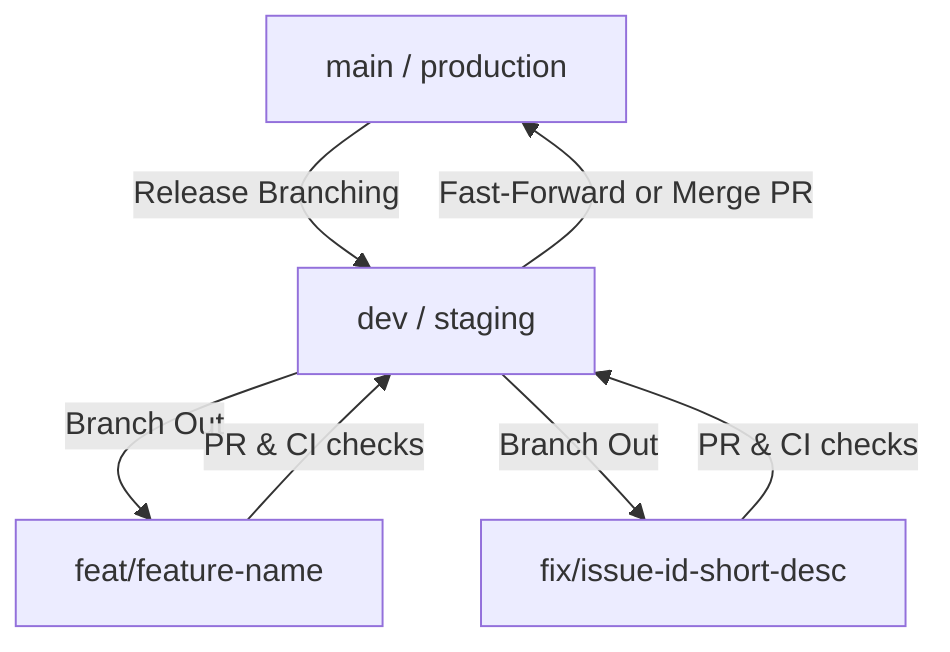

# Dev Branch Strategy & Agent-Driven Issue Tracking Guide

This guide outlines the branching strategy and issue template formats designed to optimize today's continuous integration and developer/agent pull request (PR) fix loops. It establishes clear protocols for human-agent collaboration, branch life cycles, and structured issue tracking.

---

## 1. Branching Strategy

To maintain repository health, enable parallel agent/human execution, and streamline automated testing, we use a structured branch topology:



### Branch Definitions & Policies

| Branch Pattern | Source Branch | Target Branch | Target Audience / Automated Agent Scope | Description |
| :--- | :--- | :--- | :--- | :--- |
| `main` | - | - | Production environment. Releases are tagged here. | Holds stable, production-ready code. No direct commits allowed. |
| `dev` | `main` | `main` | Staging/integration branch. | The active development integration branch. All feature and fix branches merge here first. |
| `feat/*` | `dev` | `dev` | Feature development (Humans & Agents). | Used for new capabilities or substantial refactoring. |
| `fix/*` | `dev` | `dev` | Bug fixes, patch tasks (highly optimized for Agents). | Lightweight branches used to address single issues or failed tests. |

### PR Fix Loop Lifecycle (Agent-Optimized)

1. **Trigger**: An issue is labeled or assigned to an agent (e.g., `agent-action`, `bug`).
2. **Branch Creation**: The agent creates a branch off `dev` named `fix/<issue-id>-<short-description>`.
3. **Local/Container Execution**: The agent performs workspace analysis, reproduces the bug via a test script, applies the fix, and runs local tests.
4. **Pull Request**: The agent opens a PR targeting `dev`. The PR description must adhere to the template below.
5. **CI/CD Validation**: Automated test suites and linters run on the PR.
    - *If CI fails*: The agent reads the failure log, applies further commits to the branch (the "Fix Loop"), and re-runs validation.
6. **Peer Review & Merge**: Once CI passes, a human reviewer approves and merges the PR into `dev`.

---

## 2. Issue Body Template (Agent-Driven)

Agents perform best when inputs are structured, unambiguous, and machine-readable. Below is the standard issue template to invoke and guide developer agents.

```markdown
<!-- ISSUE_TEMPLATE: AGENT_DRIVEN_FIX -->
# [Type]: Short, Descriptive Title of the Bug/Task

## 1. Context & Metadata
- **Target Component:** `[e.g., Auth Service, Payment Gateway]`
- **Severity/Priority:** `[Low / Medium / High / Critical]`
- **Related PRs/Issues:** `[e.g., #104]`
- **Environment Details:** `[e.g., Node.js v18, PostgreSQL 15, Windows 11]`

---

## 2. Problem Description
Provide a clear, high-level description of what is failing.
> [!IMPORTANT]
> Include exact error logs, tracebacks, or unexpected behavior symptoms below.

```text
[Paste logs/tracebacks here]
```

---

## 3. Step-by-Step Reproduction
1. Step 1...
2. Step 2...
3. Observed behavior: ...
4. Expected behavior: ...

---

## 4. Expected Acceptance Criteria
- [ ] Criterion 1 (e.g., "The API should return a 400 Bad Request instead of a 500 when payload is missing field X")
- [ ] Criterion 2 (e.g., "Write a unit test covering this scenario in `tests/test_auth.py`")
- [ ] Criterion 3 (e.g., "Ensure all existing test suites pass under `npm run test`")

---

## 5. Agent Instructions
- **Working Directory:** `/src/services/`
- **Recommended Branch Name:** `fix/issue-[id]-short-description`
- **Search Hints:** Check `utils/validator.js` and how it handles undefined structures.
- **Rules of Engagement:** Do not modify package dependencies unless explicitly required.
```

---

## 3. Pull Request Template (Agent-Driven)

When the agent (or developer) submits code for review, they must fill out the following PR template to summarize the change and proof of verification.

```markdown
<!-- PR_TEMPLATE: FIX_LOOP -->
## Description
Briefly describe the root cause of the issue and the implemented solution.

## Checklist
- [ ] My code follows the code style and lint guidelines of this project.
- [ ] I have verified that all unit tests pass locally.
- [ ] I have added new tests to cover the modifications and prevent regressions.
- [ ] I have verified the fix against the acceptance criteria described in the issue.

## Changes Made
- Added validation for `X` in `validator.js`
- Created unit tests `test_invalid_payload_handling` in `tests/test_auth.py`

## Proof of Verification
Include local test run outputs, screenshot links, or logs showing success.

```text
[Paste verification command output / test suite results here]
```
```

---

> [!TIP]
> Keep issue descriptions descriptive and limit agent search paths to keep the agent's context window clean and execution speed high.
